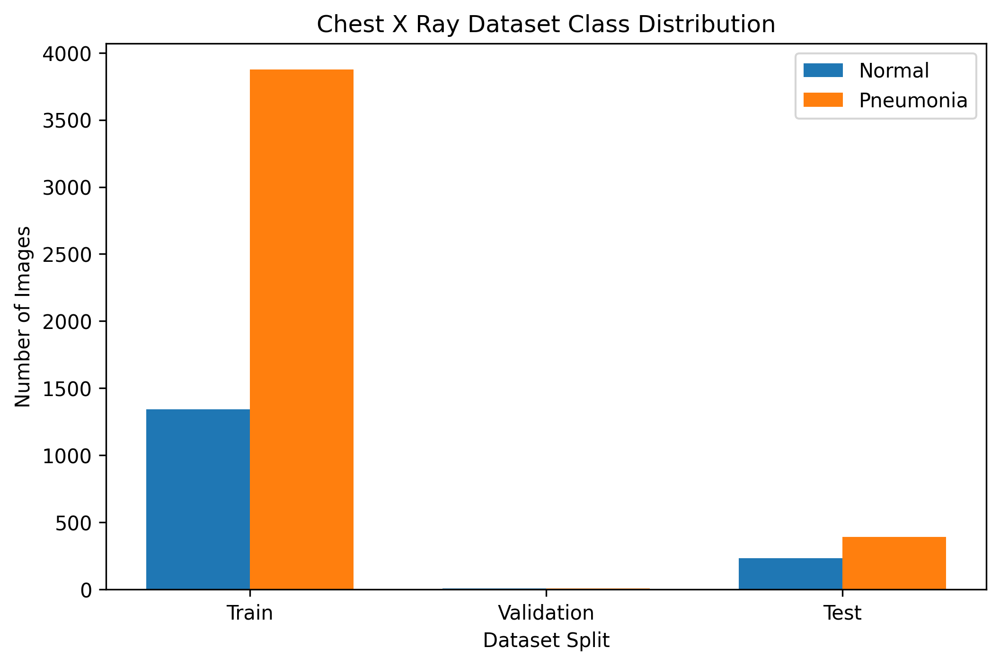
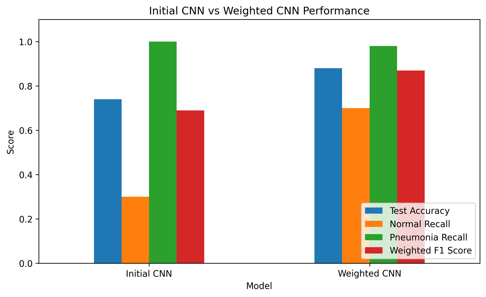
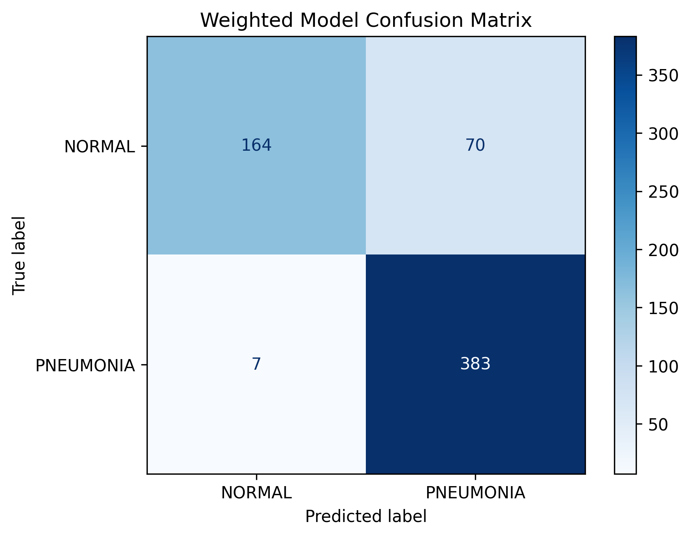
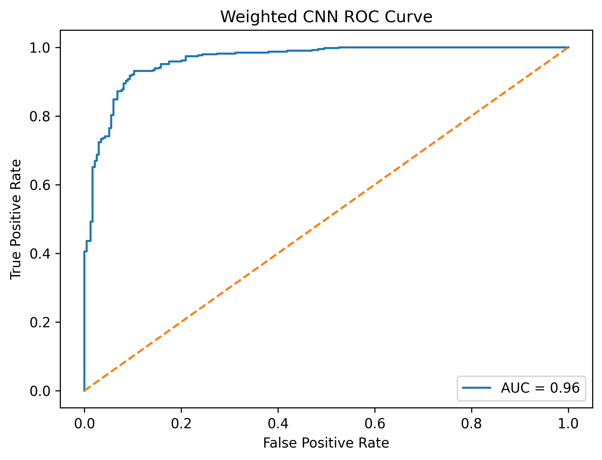
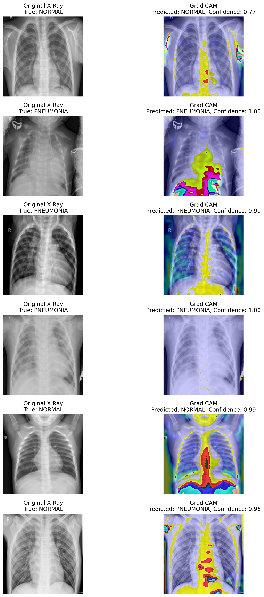

# Med Vision

Med Vision is a medical imaging deep learning project that explores how a convolutional neural network can classify chest X ray images as either normal or pneumonia.

I wanted this project to be more than just a simple classifier. The goal was to build a complete medical imaging workflow, from dataset exploration and model training to evaluation, class imbalance handling, and Grad CAM explainability.

This project is educational only. It is not a diagnostic tool and should not be used for medical decision making.

## Project Overview

Med Vision uses a public chest X ray dataset to train and evaluate a deep learning model for pneumonia classification.

The project includes:

1. Dataset loading and exploration
2. Image preprocessing
3. CNN model training
4. Test set evaluation
5. Class imbalance handling
6. Confusion matrix analysis
7. ROC curve and AUC evaluation
8. Grad CAM visual explainability
9. Responsible AI limitations

## Dataset

This project uses the Chest X Ray Images Pneumonia dataset accessed through Kaggle.

Kaggle was used as the public data access platform, but Kaggle itself is not the original medical source of the data. The dataset is reported to contain pediatric chest X ray images from Guangzhou Women and Children’s Medical Center, organized into two classes:

1. Normal
2. Pneumonia

For this project, I treated the dataset as suitable for educational machine learning practice. However, I did not treat it as a clinically validated dataset for real diagnostic use.

The training set was imbalanced, with more pneumonia images than normal images. This became an important part of the project because the first model performed well on pneumonia cases but struggled with normal X rays.

## Dataset Distribution



## Model Approach

I started with a simple convolutional neural network so I could focus on the full machine learning workflow rather than only trying to maximize accuracy.

The model used:

1. Convolutional layers
2. Max pooling
3. Batch normalization
4. Dropout
5. Binary classification with sigmoid output

The first model achieved decent accuracy, but the classification report showed that it was biased toward predicting pneumonia. To improve this, I trained a second version using class weights.

## Model Comparison



The weighted model gave a more balanced result.

| Metric | Initial CNN | Weighted CNN |
| :--- | :---: | :---: |
| Test Accuracy | 0.74 | 0.88 |
| Normal Recall | 0.30 | 0.70 |
| Pneumonia Recall | 1.00 | 0.98 |
| Weighted F1 Score | 0.69 | 0.87 |

The main improvement was normal recall, which increased from 0.30 to 0.70. Pneumonia recall also stayed very high at 0.98.

## Confusion Matrix



The weighted model correctly identified most pneumonia cases while also improving its ability to recognize normal X rays.

The model still made mistakes, especially by classifying some normal X rays as pneumonia. In a screening style context, false positives may be less concerning than false negatives, but this would still need proper clinical validation.

## ROC Curve and AUC



The ROC curve gives another view of the model's performance across different classification thresholds.

This matters because a threshold of 0.5 is not automatically the best choice in medical screening tasks. A lower threshold may catch more pneumonia cases but increase false positives, while a higher threshold may reduce false positives but risk missing more pneumonia cases.

## Grad CAM Explainability



I added Grad CAM heatmaps to make the model more interpretable. Grad CAM shows which areas of the X ray influenced the model's prediction.

This was one of the most important parts of the project because medical AI should not just output a prediction. It should also be evaluated carefully to understand what the model may be focusing on.

However, Grad CAM does not prove that the model is clinically correct. It only gives a visual clue about what image regions influenced the prediction.

## Key Results

The weighted CNN achieved:

1. Test accuracy of 0.88
2. Normal recall of 0.70
3. Pneumonia recall of 0.98
4. Weighted F1 score of 0.87
5. AUC score of about 0.96

These results show that class imbalance had a major effect on the first model, and that using class weights helped create a more balanced classifier.

## What I Learned

This project helped me understand that accuracy alone is not enough, especially in medical AI.

A model can have a decent accuracy score while still performing poorly on one class. Looking at recall, precision, F1 score, confusion matrices, and ROC curves gives a much better picture of model performance.

I also learned that medical AI projects need careful framing. A model like this can be useful for learning, research, and experimentation, but it should not be treated as a real clinical tool.

## Limitations

This project has several important limitations:

1. The dataset was accessed through Kaggle, which is a public data platform rather than the original medical source.
2. The dataset is reported to contain pediatric chest X rays, so the model may not generalize to adults.
3. The model was trained and tested on one public dataset.
4. The dataset is imbalanced.
5. The model was not externally validated on images from other hospitals or imaging systems.
6. Grad CAM heatmaps are useful, but they do not prove clinical reasoning.
7. Real medical AI systems require expert review, clinical testing, privacy safeguards, and regulatory approval.

## Future Improvements

Future versions of Med Vision could include:

1. Transfer learning with MobileNetV2, ResNet50, or EfficientNet
2. Threshold tuning to balance false positives and false negatives
3. External validation on another chest X ray dataset
4. Lung segmentation or cropping before classification
5. Better preprocessing, such as contrast normalization
6. A comparison between CNN, transfer learning, and simpler baseline models
7. A lightweight demo interface for educational use
8. More direct review of the dataset's original publication and documentation

## Tech Stack

1. Python
2. TensorFlow and Keras
3. NumPy
4. Pandas
5. Matplotlib
6. OpenCV
7. Scikit learn
8. Google Colab
9. Kaggle dataset access

## Repository Contents

```text
medvision_chest_xray_classifier.ipynb
README.md
requirements.txt
LICENSE
images/
